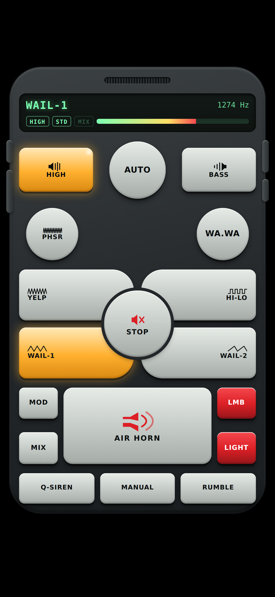
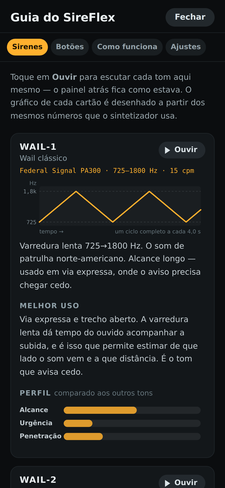

# SireFlex

**Sire**ne + giro**flex**. Um controlador de sirene, buzina e giroflex que roda no iPhone — sem App Store, sem
Xcode, sem conta de desenvolvedor. Abre no Safari, vai para a tela de início e
funciona offline.

O ponto de partida foi o faceplate do *Siren Remote Simulator* (Android), que
não tem versão para iOS. O layout foi recriado; o áudio foi feito do zero.



## O nome e a marca

**Sire**ne + giro**flex**. A marca é a varredura da própria sirene — a mesma
forma que aparece nos botões de tom — cortada ao meio nas duas cores do
giroflex. Um desenho que diz as duas metades do nome.

Ela fica no meio do painel, entre as duas teclas redondas — onde vai o
emblema do fabricante numa central de sirene de verdade — e é o mesmo desenho
do ícone da tela de início. O ícone é gerado por
`python3 tools/make-icons.py`, que escreve os PNGs à mão — traçado por campo de
distância, o que dá pontas e junções arredondadas de graça, e a divisão
vermelho/azul cai sozinha em qual metade da varredura o pixel está mais perto.

## O guia embutido

O botão lateral direito de baixo abre um guia com quatro abas: **Sirenes**,
**Botões**, **Como funciona** e **Ajustes**.

Cada sirene tem um cartão com o gráfico da sua varredura, um perfil comparativo
(alcance, urgência, penetração), para que serve na prática — e um botão para
ouvir ali mesmo, sem mexer no painel atrás.

Os gráficos são **gerados a partir das mesmas especificações que o sintetizador
lê**. Nenhum é desenhado à mão, então nenhum pode discordar do que você ouve:
mude a taxa de varredura de um tom e o desenho dele muda junto.



## O que tem de diferente

**Nada aqui é arquivo de áudio.** Todos os tons são sintetizados ao vivo pela
Web Audio API no momento em que você aperta o botão. Isso significa:

- carrega instantâneo e ocupa alguns kilobytes
- sustenta um tom por horas sem emenda audível, porque não há loop para emendar
- o air horn responde no toque, sem latência de decodificação
- funciona offline depois de instalado

E, principalmente: os tons são **calibrados pelas especificações publicadas dos
fabricantes**, não aproximados de ouvido. As faixas de frequência e as taxas de
varredura são as de verdade.

| Tom | Especificação de origem |
|---|---|
| **WAIL-1** | Federal Signal PA300 · 725–1800 Hz · 15 cpm |
| **WAIL-2** | PA300-012MSC · 700–1600 Hz · 11 cpm · varredura assimétrica |
| **YELP** | Federal Signal PA300 · 725–1800 Hz · 220 cpm |
| **PHSR** | PA300 Priority · 725–1800 Hz · 1300 cpm + batimento |
| **HI-LO** | DIN 14610 / Martin-Horn · 440 ↔ 585 Hz (lá/ré) · 70 cpm |
| **WA.WA** | 725–1800 Hz · 132 cpm com AM sincronizada |
| **AIR HORN** | Nathan AirChime · acorde a partir de 311 Hz (ré♯) |
| **Q-SIREN** | Federal Signal Q2B · rotor de 14 portas · 400–800 Hz |
| **RUMBLE** | Classe Rumbler · 182–400 Hz, acompanhando a sirene ativa |
| **MANUAL** | Wail manual · 600–1750 Hz, controlado pelo dedo |

`cpm` = ciclos por minuto, a unidade que os fabricantes usam.

## Instalar no iPhone

1. Abra o endereço no **Safari** (precisa ser o Safari — o Chrome no iOS não
   instala PWA).
2. Toque em **Compartilhar** (o quadrado com a seta para cima).
3. Role e escolha **Adicionar à Tela de Início**.
4. Toque em **Adicionar**.

Pronto. O ícone aparece junto com os outros apps, abre em tela cheia sem a barra
do Safari, e a partir daí não precisa mais de internet.

> **Instale antes de usar para valer.** Fora do modo tela cheia o iOS é bem mais
> agressivo em bloquear a tela e suspender o áudio.

### Atualizações

Não há nada para fazer. Ao reabrir o app, ele procura uma versão nova e, se
houver, troca sozinho — se nada estiver tocando a troca é silenciosa; se
estiver, aparece um aviso para tocar quando você quiser, porque cortar uma
sirene no meio da varredura para instalar atualização seria falta de educação.

Em **Ajustes**, no fim da página, fica o número da versão que está rodando e um
botão **Verificar**, para o caso de você querer a resposta agora.

## Os botões

| Botão | O que faz |
|---|---|
| **WAIL-1 / WAIL-2 / YELP / HI-LO / PHSR / WA.WA** | Travam um tom. Toque de novo para desligar. |
| **AIR HORN** | Momentâneo — só soa enquanto o dedo está em cima. |
| **MANUAL** | Momentâneo. Segure para subir o tom; solte e ele desce sozinho. |
| **Q-SIREN** | A eletromecânica: sobe em ~2,6 s e desce em roda-livre por ~30 s. Trocar de tom corta a descida — quem manda é o botão que você acabou de apertar. |
| **RUMBLE** | Acrescenta a camada grave por baixo do que estiver tocando. |
| **HIGH / BASS** | Equalização. HIGH corta e alcança longe; BASS dá corpo. Podem ser combinados. |
| **MOD** | Altera a velocidade de varredura do tom ativo: SLOW / STD / FAST. |
| **MIX** | Empilha tons em vez de trocá-los. |
| **AUTO** | Varre wail → yelp → phaser sozinho. |
| **LMB** | Giroflex vermelho/azul piscando **atrás** do controle — os botões continuam funcionando. Vem desligado e só acende aqui: nenhuma sirene liga a luz sozinha. |
| **LIGHT** | Luz branca em tela cheia (serve de lanterna). Toque para sair. |
| **STOP** | Corta tudo na hora. |
| Laterais | Volume (esquerda), liga/desliga e ajustes (direita). |

Tudo também funciona por teclado: Tab para navegar, Enter ou Espaço para
acionar. Nos botões momentâneos o som dura enquanto a tecla fica pressionada.

## Como o som é feito

Não existe um único arquivo de áudio neste projeto. Cada tom é **calculado
amostra a amostra** e entregue ao navegador como um buffer pronto.

Isso não é capricho: as coisas que tornam esses sons reconhecíveis não cabem
num grafo de osciladores. Uma buzina de ar é uma **palheta cortando o fluxo**,
e o que se ouve como aspereza é ela não repetir exatamente igual a cada
período. Uma Q-siren é um **rotor cortando ar**, e o ruído dela é modulado
pelo próprio fluxo que gera o tom — não é chiado por baixo, é o ar sendo
picado. Nada disso se liga com fios; tem que ser computado.

**Sirenes eletrônicas** são um gerador de tom empurrando um driver de
compressão. A onda é quadrada, não senoidal — daí o terceiro harmônico forte
que os detectores de sirene procuram. Os harmônicos são somados
explicitamente e descartados ao passar de Nyquist, então a varredura nunca
dobra nada de volta como nota errada.

**Onde você ouve importa tanto quanto o que toca.** Uma corneta re-entrante
de sirene é muito direcional no agudo: lá da rua, fora do eixo dela, o topo
cai e a fundamental não — é por isso que uma sirene de verdade ao ar livre é
mais redonda que uma sirene apontada para a sua cara. E o destino é o
alto-falante de um celular, que não reproduz nada abaixo de uns 500 Hz e
exagera a faixa de 2 a 5 kHz. O radiador das sirenes modela as duas coisas.

**A buzina** são duas trombetas a uma terça menor. O ciclo ativo da palheta
estreita conforme a pressão sobe, então o tom *abre* durante o ataque em vez
de só ficar mais alto; e a turbulência é aberta e fechada pela própria
palheta.

**A Q-siren** tem 14 portas no rotor e 14 no estator, da mesma largura, então
a área aberta é um triângulo. Mas o som radiado não é esse triângulo: pressão
vem da *taxa de variação* do fluxo, e a derivada de um triângulo é uma onda
quadrada — assimétrica aqui, logo rica em harmônicos pares e ímpares. Só o
regime é renderizado; a partida de 2–3 s e a descida de meio minuto são rampas
de velocidade de reprodução sobre esse laço, o que é mais barato e mais fiel,
já que numa sirene real tudo escala junto com a rotação.

Cada família passa pelo **seu** radiador: corneta com driver de compressão,
trombeta com flare, ou rotor em carcaça de aço. Usar a mesma equalização nas
três filtrava a fundamental da própria trombeta.

E nada é ouvido seco. Reflexões curtas de rua fazem mais pela credibilidade do
que qualquer ajuste de espectro, porque tom perfeitamente seco é a única coisa
que um som real nunca é.

### Emendas de laço

Um tom varrido não pode ser cortado num cruzamento por zero — a onda está em
outro ponto do ciclo no fim e no começo, e a junta estala a cada repetição.
Laços inteiros são renderizados com uma cauda extra que é cruzada sobre a
cabeça, preservando o período exato. Laços com ataque na frente usam a técnica
de sampler oposta: o material *anterior* ao início do laço entra por cima da
cauda, porque misturar a cabeça do laço quebraria a junta onde o ataque entrega
para ele — audível a cada nota, não a cada repetição.

## Rodando localmente

```bash
npm install     # só para os testes
npm start       # serve em http://localhost:8099
```

Precisa ser servido por HTTP — módulos ES não carregam via `file://`.

## Testes

São três suítes.

**`npm test`** — o projeto inteiro é uma afirmação sobre frequências, e
afirmação sobre frequência se mede. Como as vozes são aritmética pura sobre um
`Float32Array`, elas são renderizadas aqui mesmo, sem navegador, e o resultado
é conferido contra os números da tabela acima:
a taxa de varredura pelo rastro do centroide espectral, a altura por *harmonic
product spectrum* (o 2º harmônico de uma sirene fica só ~2 dB abaixo da
fundamental, então um detector de "bin mais alto" troca de oitava no meio da
varredura). Também verifica que a saída nunca passa de fundo de escala,
inclusive empilhando sirene + rumble + air horn no volume máximo.

**`npm run test:ui`** — dirige o faceplate de verdade num navegador de verdade
(precisa do `npm start` rodando). Cada verificação aqui corresponde a um defeito
que ler o código não pegou:

- o STOP deixava a Q-siren descendo por dezenas de segundos, porque chamava o release
  normal em vez de matar a voz;
- o RUMBLE lia `.lo`/`.hi` direto do tom ativo, e as especificações mecânica e
  de buzina não têm esse par — chegava ao oscilador como NaN e lançava exceção;
- a air horn ficava presa para sempre se o primeiro toque terminasse antes de o
  `AudioContext` acabar de ser construído;
- o wake lock era liberado e repedido a cada troca de tom, reiniciando o
  temporizador de inatividade do iOS a cada toque;
- um tom com cauda longa desligado pela própria tecla saía dos registros na
  hora, mas continuava soando — então o STOP depois disso não o alcançava, e
  o medidor de nível marcava zero enquanto a Q-siren ainda descia a todo
  volume;
- o modelo de frequência da Q-siren aproximava por uma exponencial só o que
  o áudio faz em dois segmentos, divergindo por mais de 4× no meio da subida:
  o mostrador mentia e desligar a sirene antes do regime derrubava o tom de
  uma vez;
- trocar de tom entregava à Q-siren a descida normal dela, de meio minuto em
  roda-livre, então ela seguia berrando por cima do tom seguinte e empurrava
  o limitador para baixo junto: o painel parecia vivo e **nenhuma outra
  sirene se ouvia**. O medidor não enxerga isso — satura dos dois jeitos —,
  então o teste conta as vozes no grafo;
- uma tecla momentânea dependia do `pointerup` do próprio botão chegar. No
  iOS o toque pode ser tomado no meio (o sistema reivindica o gesto, a
  captura se perde, o app vai para segundo plano) e o evento nunca chega: a
  nota ficava tocando para sempre e cada toque seguinte empilhava outra por
  cima. Agora a janela também vê o dedo sair, casada por identificador de
  ponteiro para não quebrar o uso com duas mãos, e o caminho de release traz
  um cão de guarda armado **antes** de qualquer coisa que possa lançar
  exceção — o teste injeta a falha em vez de discutir se ela acontece;
- e, por baixo disso tudo, o silenciamento da MANUAL era um `setTimeout` de
  3,4 s. **Timer de JavaScript não é promessa**: o iOS estrangula e descarta
  timers num app ocioso ou em segundo plano. Quando esse era descartado, a
  queda do tom ainda acontecia — essa parte é automação no relógio de áudio —
  e a nota segurava a nota grave para sempre. Hoje a voz agenda a soltura
  inteira de uma vez no relógio de áudio, e o teste desliga `setTimeout` e
  `setInterval` durante a soltura, que é o único jeito honesto de verificar
  "não depende de timer".

**`npm run test:sw`** — publica uma versão nova contra uma cópia do site e
confere que ela chega. Este é o teste de um defeito que a pessoa do outro lado
sentiu antes de qualquer um de nós: o cache respondia primeiro e a correção
publicada ficava invisível no telefone. Ele instala o service worker, reescreve
os arquivos, pergunta ao worker por um deles — tem de vir o novo —, reabre
**uma** vez e lê o número da versão na tela, e por fim corta a rede, porque a
correção não pode ter custado o funcionamento offline.

A cópia é servida com `Cache-Control: max-age=600`, o mesmo cabeçalho do GitHub
Pages, e isso não é detalhe: sem ele o teste mede uma situação mais fácil que a
real. A primeira versão deste arquivo servia sem cabeçalho nenhum, passava aqui
e reprovava no CI — onde os tempos calharam de cair dentro da janela em que o
navegador se acha no direito de reaproveitar a cópia. O CI estava certo.

```
63/63 checks passed      (áudio)
87/87 UI checks passed   (navegador)
7/7 update checks passed (publicação)
```

Os ícones são gerados por `python3 tools/make-icons.py`, que escreve os PNGs à
mão — sem dependência de biblioteca de imagem.

## Avisos

**Volume e audição.** Ligado a uma caixa de som, esse material chega fácil a
níveis que machucam. Comece baixo.

**Fotossensibilidade.** Os botões LMB e LIGHT piscam forte. Quem tem epilepsia
fotossensível deve deixá-los desligados.

**Uso.** Simulador para uso pessoal, estudo e produção de áudio. Imitar sirene
de viatura em via pública é infração — e, dependendo da situação, crime — na
maior parte do mundo, Brasil incluído. Não use para se passar por autoridade
nem para obrigar alguém a sair da frente.

## Fontes dos números

- Federal Signal PA300, modelos 690000/690001 — faixa 725–1800 Hz; wail 15 cpm,
  yelp 220 cpm, hi-lo 70 cpm, priority 1300 cpm. Modelo 012MSC: 700–1600 Hz.
- DIN 14610 (Martinshorn) — dois tons fixos a uma quarta justa, razão 1:1,33,
  dentro de 360–630 Hz; Martin-Horn afinado em lá/ré (440/585 Hz).
- Sirene classe Rumbler — 182–400 Hz, tocada em conjunto com a sirene aguda.
- Buzinas de acorde Nathan AirChime — fundamentais entre ~311 Hz (ré♯) e
  415 Hz (sol♯); harmônicos acima de 5 kHz.
- Federal Signal Q2B — rotor de 14 portas, 123 dB a 3 m, fundamental variável
  com a rotação (≈400–800 Hz em regime), embreagem de roda-livre.
